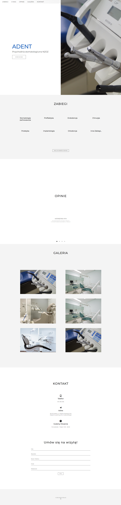

# Adent-Siedlce

This repository contains the source code for the Adent-Siedlce project. The project is a web application for managing and booking appointments at the Adent-Siedlce dental clinic.

## Technologies

The Adent-Siedlce application is built using the following technologies:

- Frontend: HTML, CSS, JavaScript

## Requirements

To run the project locally, you need to have the following software installed:
- [Node.js](https://nodejs.org)

## Installation
1. Clone the repository:
2. Navigate to the project directory: `cd Adent-Siedlce`
3. Run it with live-server 

## Author

- [JaayRad](https://github.com/JaayRad)

## License

This project is licensed under the MIT License. For more information, please see the [LICENSE](LICENSE) file.

## Contribution

If you would like to contribute to the project, feel free to submit pull requests. Before making any significant changes, please open an issue to discuss the proposed changes.

## Contact

For any questions or suggestions, please contact [JaayRad](https://github.com/JaayRad).
## Screenshots:

